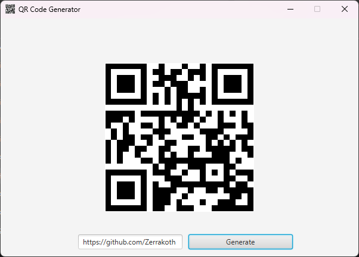

# qr-code-generator

I decided to challenge myself and practice my Java skills by developing a simple application. My goal was to interact with some sort of API and make use of its data. I also wanted to transition IDEs by switching from using jGrasp to IntelliJ. In doing this, I was also able to get some practice with using Maven for the first time!

This application allows you to generate unique QR codes for any URL you input into it. You can create as many unique QR codes as you'd like!

In the future, I might incorporate some additional features or change some deprecated features I had used. For now, though, I'm happy with what I've made!

## API Used
https://goqr.me/api/

## Technologies Used

- JavaFX
- Maven
- Scene Builder
